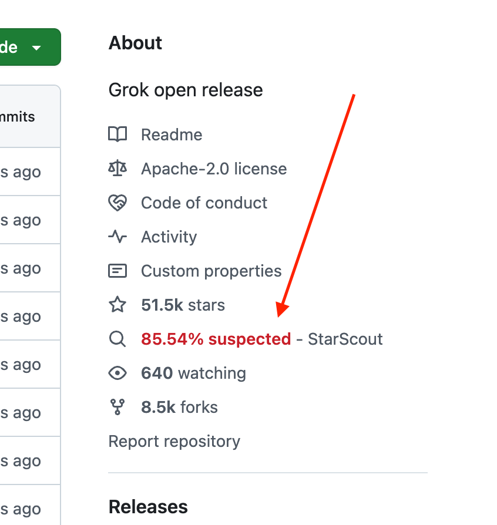
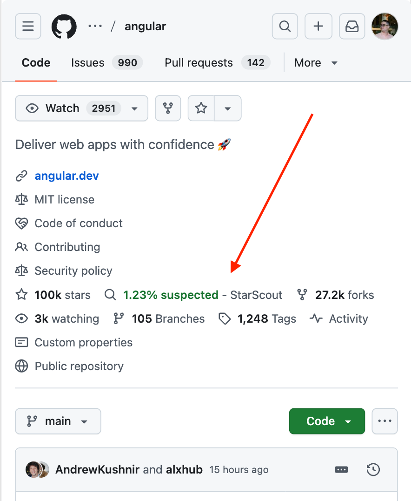

# StarScout Extension

Browser extension and backend API for showing StarScout-derived suspected non-legit
star signals on public GitHub repository pages.

The extension adds a `StarScout` badge near GitHub's native repository star
count and opens a details popover with aggregate metrics and attribution.

### Results are bounded by the StarScout dataset cutoff, currently `2025-01-01`.

| Desktop | Mobile |
| --- | --- |
|  |  |

## What It Does

- Detects public `github.com/{owner}/{repo}` repository pages.
- Sends only the public `owner/repo` name to the backend.
- Shows a compact neutral `StarScout` badge near GitHub's native star control.
- Opens a popover with aggregate suspected-star metrics, current GitHub stars,
  estimated legitimate stars, warnings, dataset cutoff, and attribution.
- Uses the StarScout Zenodo MongoDB dump imported into Postgres as aggregate-only
  serving data.

## What It Does Not Claim

- It does not prove that stars are fake.
- It does not prove that remaining stars are legitimate.
- It does not expose suspected actor identities.
- It does not support private repositories or GitHub Enterprise Server.
- It does not replace GitHub's native star count.

## Documentation

Start here based on what you need:

- Development setup, deployment, packaging, and verification: [docs/development.md](docs/development.md).
- Architecture notes: [docs/architecture.md](docs/architecture.md).
- Public privacy notice content: [docs/privacy.md](docs/privacy.md).

Repository map:

- `backend/` - FastAPI backend and importer managed with `uv`.
- `extension/` - WXT + React browser extension.
- `infra/` - Docker Compose infrastructure.
- `docs/` - Developer, architecture, deployment, QA, and attribution notes.
- `plans/` - Implementation plans and acceptance criteria.

## Privacy Posture

- Sends only the public `owner/repo` identifier to the backend.
- Does not send user identity, GitHub credentials, extension-specific user IDs,
  or private repository data.
- Does not show actor-level suspected stargazer evidence.
- Backend returns aggregate repo-level metrics only.
- The public API is read-only and rate-limited.
- Operational logs should avoid long-lived per-user browsing history.

See [docs/privacy.md](docs/privacy.md) for the public privacy notice content.

## Attribution

This project uses StarScout-derived data and methodology.

- StarScout repository: https://github.com/hehao98/StarScout
- Zenodo replication package DOI: https://doi.org/10.5281/zenodo.17009694
- Paper: Hao He, Haoqin Yang, Philipp Burckhardt, Alexandros Kapravelos,
  Bogdan Vasilescu, and Christian Kaestner. 2026. Six Million (Suspected) Fake
  Stars on GitHub: A Growing Spiral of Popularity Contests, Spam, and Malware.
  ICSE 2026.

## License

MIT. See `LICENSE`.
